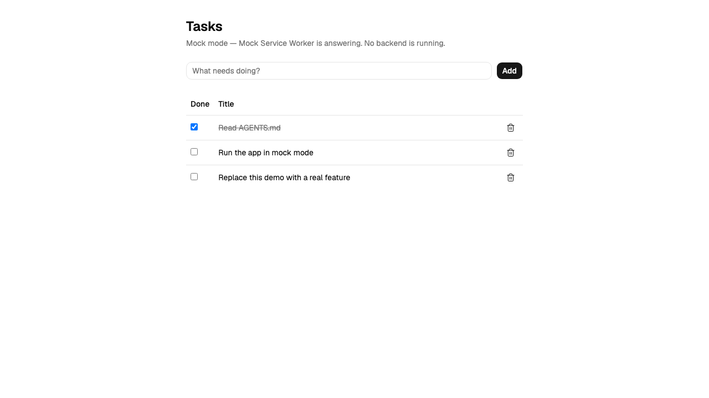
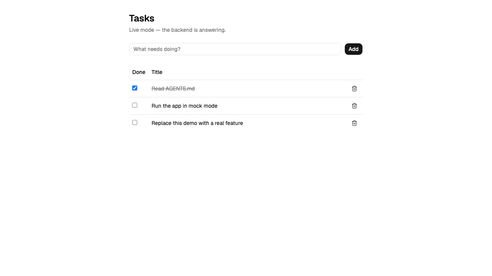

# agent-ready-fullstack-ts-python

[](https://github.com/CodeMocsh/agent-ready-fullstack-ts-python/actions/workflows/check.yml)
[](https://www.python.org/downloads/)
[](https://nodejs.org/)
[](https://react.dev/)
[](https://fastapi.tiangolo.com/)
[](https://github.com/copier-org/copier)

A [Copier](https://copier.readthedocs.io/) **template** that generates a **monorepo
application** — a React frontend talking to a FastAPI backend — set up to work well with AI
coding agents out of the box.

A generated project starts with a working screen: a small CRUD list, wired end to end through
TanStack Query. Run `make dev` and both halves come up, the browser talks to Python, and the
data is real. Run `make dev-frontend` and the same screen works with **no backend and no
Python installed at all**, answered by a [Mock Service Worker](https://mswjs.io/) layer.

Both are permanent modes, not stages. The mock handlers are what every component test runs
against, and they are typed against the backend's own OpenAPI spec, so a handler that disagrees
with the service is a compile error rather than a surprise at runtime.





Those are the same screen. The only difference is the line under the heading saying which half
answered — mock mode above, the FastAPI backend below. That is the point: no feature behaves
differently between the modes, so the picture of one is the picture of both. Both are produced
by `make screenshots`, which renders the template and drives the real app, so neither can drift
from what the template generates today.

A template that generates one artifact can stop at making it good. This one generates a
**system**: two halves that have to agree with each other. So it ships a contract, and a test
suite that runs twice — once against the mocks and once against the real backend — to prove
they do.

## Usage

```bash
uvx --exclude-newer "14 days" copier@9.17.1 copy \
  gh:CodeMocsh/agent-ready-fullstack-ts-python my-app
```

You'll be prompted for the project name and a few details. Then:

```bash
cd my-app
git init && git add . && git commit -m "Initial commit"
make install        # both halves, and the git hooks

make dev            # backend on :8000, frontend on :5173
make dev-frontend   # or just the frontend, mock mode, no backend at all
make lint test      # both halves, then the contract suite across both
```

Commit before `make install`: the installer activates the project's git hooks, and that needs a
repository to install them into.

Projects record their answers in `.copier-answers.yml`, so
`uvx --exclude-newer "14 days" copier@9.17.1 update` pulls later template improvements as a
three-way merge. Review the diff, resolve any `.rej` files, and run `make openapi` if the
contract artifacts were among them — the generated project's own `docs/installation.md` says
what else to expect.

## The contract

The backend is the single authoring point. Everything downstream is derived and committed:

```
backend/app/{models,routes}.py  ->  openapi.json  ->  frontend/src/api/schema.ts
                                                       -> types.ts, mocks/handlers.ts
```

`make openapi` regenerates both artifacts; `make openapi-check` fails if the committed ones are
stale, and it is in the gate. Committing them is what keeps each half independently operable:
the frontend regenerates its types, runs its tests and builds with no Python present. Why a
generated file belongs in git is [adr/0002](docs/adr/0002-code-first-contract-with-committed-artifacts.md).

## The stack

| | frontend | backend |
|---|---|---|
| runtime | Node 24 | Python 3.12 |
| package manager | [pnpm](https://pnpm.io/) | [uv](https://docs.astral.sh/uv/) |
| framework | [React](https://react.dev/) + [Vite](https://vite.dev/) | [FastAPI](https://fastapi.tiangolo.com/) + [pydantic](https://docs.pydantic.dev/) |
| routing / state | [TanStack Router](https://tanstack.com/router) + [Query](https://tanstack.com/query) | [uvicorn](https://www.uvicorn.org/), asyncpg or in-memory |
| styling | [Tailwind CSS](https://tailwindcss.com/) + [shadcn](https://ui.shadcn.com/) on [Base UI](https://base-ui.com/) | — |
| lint + format | [biome](https://biomejs.dev/), React domain on | [ruff](https://docs.astral.sh/ruff/) |
| types | `tsc --noEmit` | [BasedPyright](https://docs.basedpyright.com/) |
| tests | [vitest](https://vitest.dev/) + [Testing Library](https://testing-library.com/), [Playwright](https://playwright.dev/) | [pytest](https://docs.pytest.org/) |
| contract | [openapi-typescript](https://openapi-ts.dev/) + [openapi-msw](https://github.com/christoph-fricke/openapi-msw) | `app.openapi()`, exported in-process |

## The agent-ready layer

- **`AGENTS.md` + `CLAUDE.md`** — one source of agent instructions at the root, covering both
  halves: principles, a layout map, the rules that bite, and an index into everything else.
- **A see-what-you-built loop** — Playwright wired up in both mock and live mode, and an
  instruction to run the app and read a screenshot rather than infer behaviour from JSX.
- **A contract suite that runs twice** — identical assertions against the mock handlers and
  against the running backend through the dev proxy. Both runs are in the generated project's
  `make pre-commit`, the second being the one check that needs both toolchains at once.
- **A dependency-free agent guard** (`.claude/hooks/agent_guard.py`) — a `PreToolUse` hook
  blocking a small set of unambiguously dangerous actions. Standard-library Python, so it works before
  either half has been installed. Fails open. A seatbelt, not a security scanner.
- **Conformance gates on both halves** — a design-system and React ruleset on the frontend,
  ruff's correctness families on the backend, architectural invariants across both, and a
  complexity ratchet per half in its own unit. Each gate states the fix in its own failure, so
  none of it needs a doc in the generated project; [docs/conformance.md](docs/conformance.md)
  has the measurements behind the numbers.
- **Supply-chain defaults that hold without anyone remembering them** — a release cool-off on
  both halves, pnpm's `trustPolicy: no-downgrade`, and runtime dependencies bounded
  above as well as below.
- **[Entire](https://entire.io) session-tracking hooks** that checkpoint agent coding sessions
  alongside git history. They no-op until the `entire` CLI is installed, and `.claude/` and
  `.entire/` can be deleted to drop the feature.

## Working on the template

```bash
make check        # default variant, end to end
make check-all    # every license variant
make fast         # render and assert only, skipping install/lint/test/build
make hooks        # enable the pre-commit hook (once per clone)
make screenshots  # redraw the two above, from a project rendered on the spot
```

A full run installs both toolchains, audits the frontend's production dependencies, lints and
tests both halves, regenerates the contract and diffs it, runs the contract suite twice against
a live backend — through the dev proxy and through `app.serve` on one origin — and finally boots
`make dev` and stops it to prove both ports are released. **Editing `template/` and trusting the diff proves nothing: render it and
exercise the output.**

- **`copier.yml`** — the questions a new project is asked, and the post-copy message.
- **`template/`** — everything rendered into a new project.
- **`devtools/check_template.sh`** — the whole of the enforcement, run by the pre-commit hook
  and by the workflow on every pull request. A check that is not in this script runs nowhere.
- **`docs/`** — [constraints.md](docs/constraints.md) for what is load-bearing, and
  [adr/](docs/adr/) for the decisions.

See [AGENTS.md](AGENTS.md) to start working here and [CONTEXT.md](CONTEXT.md) for the
vocabulary. [CONTRIBUTING.md](CONTRIBUTING.md) says what a change owes before it can land.

## Versions, and reporting

Copier resolves to the newest git tag rather than to `main`, so the version you generate from is
a release. `VERSION` says which one this repo claims to be at, and the releases page says what
each one changed — GitHub writes that from the pull requests, so it cannot drift from what
landed.

A vulnerability goes through private reporting and never into a public issue —
[SECURITY.md](SECURITY.md) says how, and names what the template does not do on purpose.
Conduct is the [Contributor Covenant](CODE_OF_CONDUCT.md).

## License

[MIT](LICENSE). A project you generate chooses its own license when the generator asks, and
carries no obligation back to this one.
